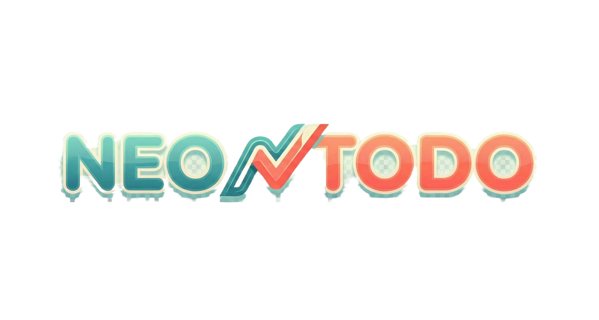

# NeoTodo

A Neo-Brutalist Productivity Application built for simple, effective, and aesthetic task management.

## Features

- **Neo-Brutalist Design**: Bold borders, high contrast, and vivid colors.
- **Firebase Integration**: 
  - **Authentication**: Secure Google Login & Guest Mode support.
  - **Cloud Sync**: All tasks, stacks, and history are synced to the cloud via Firestore.
- **Task Management**: Simple To-Do list with priority levels (Urgent, Medium, Normal).
- **Organization**: Group tasks into custom Stacks.
- **Recursion**: Support for daily recurring tasks.
- **Digital Garden**: Gamified productivity - grow your garden by completing tasks.
- **History**: Track your productivity streak and completion history.
- **PWA Support**: Installable as a native app on mobile and desktop.
- **Mobile First**: Optimized touch interactions (swipe, long-press) and responsive layout.

## Tech Stack

- **Framework**: [React](https://react.dev/) + [Vite](https://vitejs.dev/)
- **Language**: [TypeScript](https://www.typescriptlang.org/)
- **Backend**: [Firebase](https://firebase.google.com/) (Auth, Firestore, Hosting)
- **Styling**: [Tailwind CSS](https://tailwindcss.com/)
- **Icons**: [Lucide React](https://lucide.dev/)
- **Animations**: [Framer Motion](https://www.framer.com/motion/)

## Deployment

Hosted on Firebase Hosting / GitHub Pages (depending on active configuration).
Live URL: [https://kutral.github.io/todo/](https://kutral.github.io/todo/)

## Developed By

**Kutral**

---
Built with ❤️ and bold CSS.
